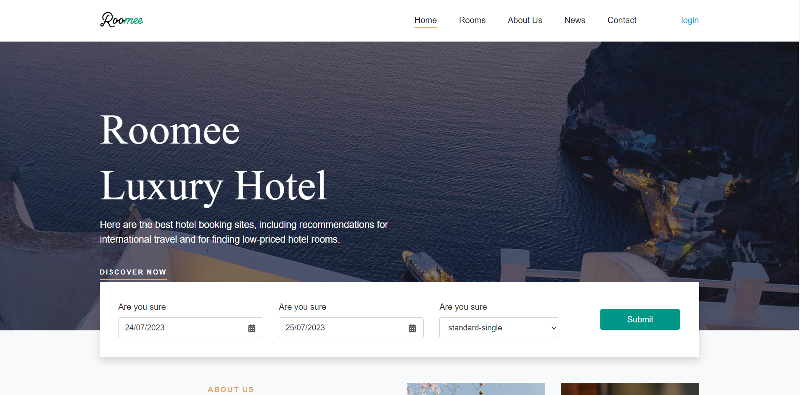
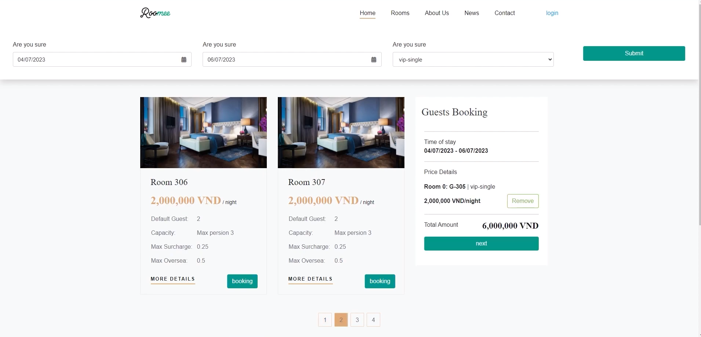
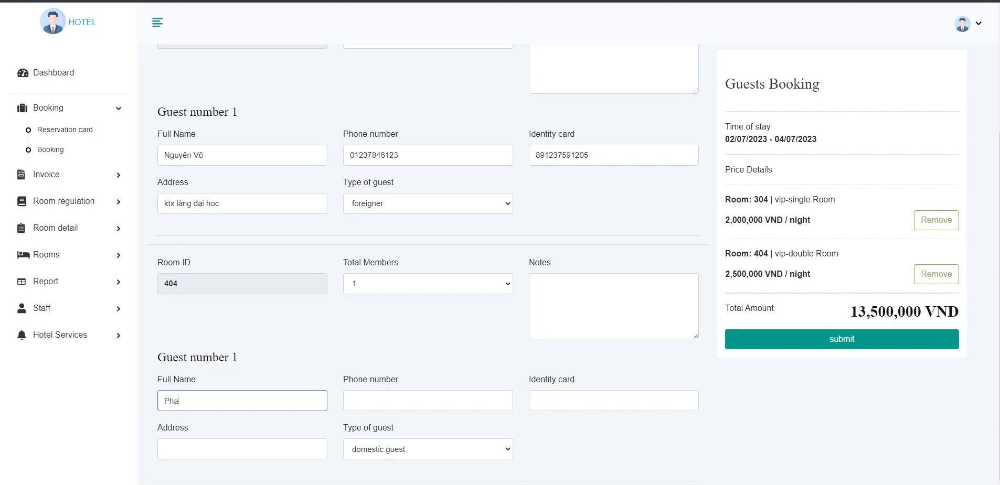
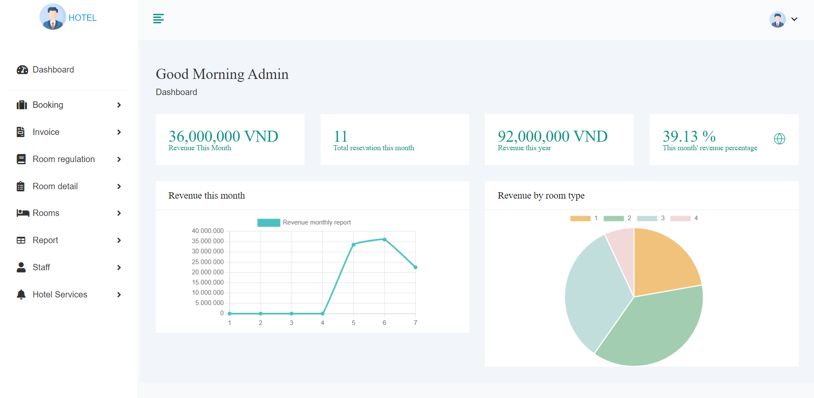

# RestHotel

A booking online and management booking all-in-one platform for hotels, using a 2-tier 3-layer architecture with ASP.NET Core 7.

## Technologies

- ReactJS, Boostrap4, JQuery.
- ASP.NET core 7, Entity Framework, SQL server.
- Nginx,Redis,Docker swarm.

## Features

- Booking rooms by both guests and staff.
- Online payment through Momo, Stripe, Paypal.
- Authentication and authorization for staff and managers.
- Account management.
- Room management.
- Hotel Services management.
- Invoices management.
- Reporting revenue and room occupancy.
- Setting room regulations, room details...
- ...

In this project, I worked with 4 teammates. My work was focused on building completely three features:

- Accounts management.
- Rooms management.
- Hotel Services management.

## Demo

[Watch demo on Youtube](https://www.youtube.com/watch?v=hRd2klr8Maw)
[Try online](https://roomee.netlify.app/)

